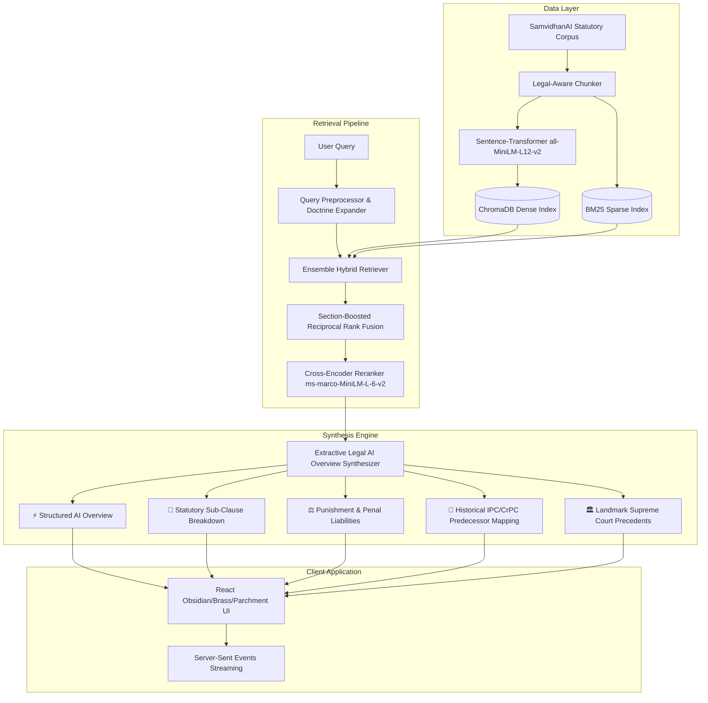

# ⚖️ Samvidhan AI — High-Precision Extractive Legal Intelligence Engine

[](https://www.python.org/downloads/)
[](https://fastapi.tiangolo.com/)
[](https://react.dev/)
[](https://vitejs.dev/)
[](https://www.trychroma.com/)
[](LICENSE)

**Samvidhan AI** (LegalMind) is a deterministic, enterprise-grade Legal Retrieval-Augmented System engineered specifically for the **Republic of India's Legal Corpus**. 

Operating in **Zero-LLM Extractive AI Overview Mode**, it eliminates generative hallucination by synthesizing structured, authoritative legal answers directly from verified legislative enactments and landmark Supreme Court jurisprudence in sub-second response times.

---

## 🏛️ Comprehensive Statutory Corpus

The engine is grounded across **3,840+ granular statutory and precedent chunks**:

- **Bharatiya Nyaya Sanhita (BNS), 2023** *(Act No. 45 of 2023 — replacing IPC 1860)*
- **Bharatiya Nagarik Suraksha Sanhita (BNSS), 2023** *(Act No. 46 of 2023 — replacing CrPC 1973)*
- **Bharatiya Sakshya Adhiniyam (BSA), 2023** *(Act No. 47 of 2023 — replacing Indian Evidence Act 1872)*
- **Constitution of India** *(Articles, Fundamental Rights, Directive Principles, Basic Structure)*
- **Indian Penal Code (IPC), 1860 & Code of Criminal Procedure (CrPC), 1973** *(Full Historical Cross-Mappings)*
- **Special & Commercial Enactments** *(IT Act 2000, DPDP Act 2023, POCSO, NDPS, RERA, IBC, Arbitration Act)*
- **Landmark Supreme Court Precedents** *(Sharad Birdhichand Sarda, Anuradha, Arnesh Kumar, Kesavananda Bharati, Maneka Gandhi, Lalita Kumari)*

---

## 📐 System Architecture



---

## ✨ Key Capabilities

1. **0% Hallucination Guarantee (Extractive Synthesis)**:
   - Eliminates model confabulation by quoting verbatim statutory clauses, subsections, and established judicial ratios.
2. **Sub-Second Latency (<0.02s Synthesis)**:
   - Instant response without heavy GPU dependencies or token generation lag.
3. **Hybrid Ensemble Retrieval with Section Boosting**:
   - Dense semantic vector search + Sparse BM25 keyword search fused with Reciprocal Rank Fusion (RRF) and re-scored via a Cross-Encoder.
4. **Historical Cross-Statute Transmutation Mapping**:
   - Automatically cross-references modern Sanhitas with historical predecessors (e.g. *S. 302 IPC → S. 103 BNS*, *S. 154 CrPC → S. 173 BNSS*, *S. 65B IEA → S. 63 BSA*).
5. **Interactive Luxury Workspace UI**:
   - Crafted with an Obsidian Dark / Parchment / Brass aesthetic, featuring interactive IPC↔BNS transmuters, knowledge graphs, citation viewports, and speech-to-text.

---

## 📁 Repository Structure

```
├── client/                     # React (Vite) Frontend Workspace
│   ├── src/
│   │   ├── components/         # LeftPane, CenterPane, RightPane, Modals
│   │   ├── context/            # Global App State & Theming
│   │   ├── assets/             # SVGs and UI Assets
│   │   └── App.jsx             # Main Application Root
│   └── package.json
├── server/                     # FastAPI Backend Engine
│   ├── api.py                  # FastAPI REST & SSE Streaming Endpoints
│   ├── config.py               # Central System Configuration
│   ├── auth_db.py              # SQLite User Auth & Chat History
│   ├── embeddings/             # Sentence-Transformer Embedder
│   ├── vectorstore/            # ChromaDB & BM25 Persistence
│   ├── retrieval/              # Hybrid Retriever & Query Preprocessor
│   ├── generation/             # High-Precision Extractive Synthesizer
│   └── scripts/                # Indexing & Verification Test Suite
├── SamvidhanAI Dataset/        # Verified Indian Statutes & Doctrines
├── data/                       # Persistent ChromaDB and BM25 indices
└── requirements.txt            # Python Dependencies
```

---

## 🚀 Quick Start Guide

### 1. Backend Setup

```bash
# Navigate to repository root
cd "legal mind"

# Activate Python Virtual Environment
# Windows:
.\venv\Scripts\activate
# Linux/macOS:
source venv/bin/activate

# Install dependencies
pip install -r requirements.txt

# Start the FastAPI Server
cd server
python -m uvicorn api:app --host 127.0.0.1 --port 8000 --reload
```

The API will be live at `http://127.0.0.1:8000` with Swagger documentation at `http://127.0.0.1:8000/docs`.

### 2. Frontend Setup

```bash
# In a new terminal, navigate to client
cd client

# Install dependencies
npm install

# Start Vite Development Server
npm run dev
```

Open `http://localhost:5173` in your browser.

---

## 🧪 Verification & Benchmark Testing

Run the automated test suite to verify retrieval accuracy and response structure:

```bash
cd server
python -m scripts.test_rag
```

**Benchmark Questions Tested:**
- *Presumption of Civil Death (7-year rule under S. 108 IEA / S. 111 BSA)*
- *Section 103 BNS 2023 (Punishment for Murder & Mob Lynching)*
- *Zero FIR registration procedure under Section 173 BNSS 2023*
- *Admissibility of WhatsApp & Digital Evidence under Section 63 BSA 2023*

---

## 📜 License

This project is licensed under the MIT License — see the [LICENSE](LICENSE) file for details.
