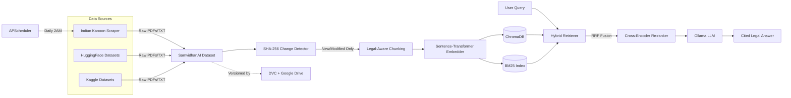

# ⚖️ Samvidhan AI — AI-Powered Legal Research for Indian Law

[](https://www.python.org/downloads/)
[](https://fastapi.tiangolo.com/)
[](LICENSE)
[-black.svg)](https://ollama.com/)

**Samvidhan AI** is an industry-grade Retrieval-Augmented Generation pipeline built specifically for the Indian Legal Corpus. Designed with **core Python** (no high-level abstractions like LlamaIndex), it provides deep control over every retrieval and generation phase. The system uses a **hybrid retrieval architecture** — combining semantic dense search (ChromaDB) with keyword sparse search (BM25), fused via Reciprocal Rank Fusion (RRF), and re-ranked with a cross-encoder — to deliver precise, citation-backed legal answers from a locally-running LLM.

> **49,000+ legal documents** ingested from Indian Kanoon, HuggingFace, and Kaggle datasets.  
> **3,812 chunks** embedded and indexed across 3 pipeline runs.  
> **100% offline** — sensitive legal data never leaves your machine.

---

## 📐 Architecture



### Pipeline Phases

| Phase | Module | What it does |
|-------|--------|-------------|
| **1. Collection** | `scripts/data_sources/` | Scrapes Indian Kanoon, pulls HuggingFace & Kaggle datasets |
| **2. Ingestion** | `ingestion/` | SHA-256 change detection, PDF/TXT parsing, legal-aware hierarchical chunking |
| **3. Indexing** | `embeddings/` + `vectorstore/` | Embeds new chunks, updates ChromaDB vectors & rebuilds BM25 |
| **4. Retrieval** | `retrieval/` | Queries both indices, fuses with RRF (k=60), re-ranks with cross-encoder |
| **5. Generation** | `generation/` | Builds citation-enforced prompts, streams answers from local Ollama LLM |
| **6. Versioning** | DVC | Commits dataset + chunk snapshots to Google Drive |

---

## ✨ Key Features

- **Hybrid Retrieval (ChromaDB + BM25 + RRF + Cross-Encoder)** — Not a basic vector search. Dense and sparse results are fused via Reciprocal Rank Fusion, then re-scored by a cross-encoder (`ms-marco-MiniLM-L-6-v2`) for maximum precision on strict legal terminology.
- **Incremental Pipeline** — SHA-256 hash-based change detection means only new or modified documents get re-embedded. No wasted compute.
- **Multi-Source Data Ingestion** — Automated collection from Indian Kanoon (web scraping), HuggingFace (`sujantkumarkv/indian_legal_corpus`), and Kaggle (`vangap/indian-supreme-court-judgments`).
- **Fully Local & Private** — Runs entirely on your machine using Ollama (Llama 3.2 / Mistral). No API keys, no cloud dependencies for inference.
- **Dual Interface** — Interactive terminal CLI + FastAPI backend serving a React frontend.
- **Dataset Versioning** — DVC tracks the raw corpus and processed chunks, synced to Google Drive.

---

## 🛠️ Tech Stack

| Layer | Technology |
|-------|-----------|
| **Backend** | Python 3.9+, FastAPI, Uvicorn |
| **Vector Store** | ChromaDB (dense semantic search) |
| **Sparse Index** | rank-bm25 (keyword search) |
| **Embeddings** | `sentence-transformers/all-MiniLM-L6-v2` |
| **Re-ranking** | `cross-encoder/ms-marco-MiniLM-L-6-v2` |
| **LLM** | Ollama (default: `llama3.2:latest`) |
| **Frontend** | React (Vite) |
| **Versioning** | DVC + Google Drive |
| **Scheduling** | APScheduler |

---

## 🚀 Getting Started

### Prerequisites

- **Python 3.9+**
- **[Ollama](https://ollama.com/download)** installed and running
- **Git** (for cloning and DVC)

### 1. Clone & Install

```bash
git clone https://github.com/Har-dik25/Samvidhan_AI.git
cd Samvidhan_AI

python -m venv venv
source venv/bin/activate      # Windows: venv\Scripts\activate

pip install -r requirements.txt
```

### 2. Pull an LLM Model

```bash
ollama pull llama3.2
```

### 3. Configure (`server/config.py`)

All runtime settings live in [`server/config.py`](server/config.py). Key values to review:

| Setting | Default | Description |
|---------|---------|-------------|
| `OLLAMA_MODEL` | `llama3.2:latest` | Local LLM model name (must match an `ollama pull`'d model) |
| `EMBEDDING_MODEL` | `all-MiniLM-L6-v2` | Sentence-transformer model for embeddings |
| `DATASET_PATH` | `SamvidhanAI Dataset` | Where raw legal documents are stored |
| `INGESTION_BATCH_LIMIT` | `5000` | Max files ingested per source per pipeline run |
| `USE_RERANKER` | `False` | Enable cross-encoder re-ranking (adds ~1s latency) |
| `OLLAMA_BASE_URL` | `http://localhost:11434` | Ollama server address |

All paths are relative to the project root. Environment variables (via `.env`) override defaults.

### 4. Initialize the Dataset & Index

On first setup, run the pipeline once to scrape, ingest, embed, and version your data:

```bash
cd server
python -m scripts.pipeline --run-now
```

This will:
1. Scrape Indian Kanoon judgments and statutory texts
2. Download cases from HuggingFace and Kaggle
3. Detect new files, parse, clean, and chunk them
4. Embed chunks into ChromaDB and build the BM25 index
5. Commit the dataset snapshot via DVC

---

## 💻 Usage

### Option A: Terminal CLI

```bash
cd server
python main.py
```

Interactive REPL — type a legal question, get a cited answer. Type `quit` to exit.

### Option B: Web Application (API + Frontend)

**Start the FastAPI backend:**
```bash
cd server
python -m uvicorn api:app --reload
```

**Start the React frontend** (in a separate terminal):
```bash
cd client
npm install
npm run dev
```

The API will be available at `http://localhost:8000` and the frontend at `http://localhost:5173`.

### Option C: Automated Data Pipeline

Run the full scrape → ingest → embed → version pipeline:

```bash
cd server
python -m scripts.pipeline --run-now     # Run once immediately
python -m scripts.pipeline               # Start daily scheduler (2:00 AM)
```

---

## 📂 Project Structure

```
Samvidhan_AI/
├── server/                      # Backend (all Python code)
│   ├── config.py                # Central configuration
│   ├── api.py                   # FastAPI backend (dual LangChain + Core approach)
│   ├── main.py                  # Interactive CLI
│   ├── auth_db.py               # User authentication
│   ├── embeddings/              # Sentence-transformer embedding logic
│   ├── vectorstore/             # ChromaDB + BM25 store implementations
│   ├── retrieval/               # Hybrid retriever (RRF fusion + re-ranking)
│   ├── generation/              # Prompt builder + Ollama LLM client
│   ├── ingestion/               # PDF/TXT parser, chunker, change detector
│   ├── evaluation/              # RAG evaluation metrics
│   └── scripts/
│       ├── pipeline.py          # APScheduler orchestrator
│       ├── ingest_all.py        # Incremental ingestion driver
│       ├── build_index.py       # Embedding + index builder
│       └── data_sources/
│           ├── web_scraper.py       # Indian Kanoon + statute scraper
│           ├── huggingface_ingest.py # HuggingFace dataset downloader
│           └── kaggle_ingest.py     # Kaggle dataset downloader
├── client/                      # React frontend (Vite)
├── data/                        # Generated indices & metadata
│   ├── chroma_db/               # Persistent ChromaDB vectors
│   ├── bm25_index/              # Cached BM25 sparse index
│   ├── chunks/                  # DVC-versioned processed chunks (JSONL)
│   └── metadata.db              # SQLite: doc hashes, embeddings, run history
├── SamvidhanAI Dataset/             # DVC-versioned raw legal documents (49,000+ files)
├── logs/                        # Pipeline and API logs
├── docs/                        # Documentation
├── requirements.txt
└── README.md
```

---

## 📊 Pipeline Run History

Every pipeline run is logged to `data/metadata.db`. Query it with:

```bash
sqlite3 data/metadata.db "SELECT * FROM pipeline_runs ORDER BY run_time;"
```

| Run | Timestamp | Docs Scraped | Chunks Embedded | Duration |
|-----|-----------|-------------|-----------------|----------|
| 1 | 2026-08-01 18:46 | 7 | 2,667 | 4m 09s |
| 2 | 2026-08-01 18:51 | 100 | 775 | 1m 52s |
| 3 | 2026-08-02 01:20 | 63 | 370 | 7m 47s |

**Total chunks embedded: 3,812** across 3 incremental runs.

---

## ☁️ Cloud Sync (DVC)

The dataset is versioned locally with DVC and configured to sync with Google Drive:

```bash
dvc push
```

A browser window will open for Google authentication. After logging in, your datasets will be uploaded to the configured Google Drive folder.

To pull data on a new machine:
```bash
dvc pull
```

---

## 🤝 Contributing

Contributions, issues, and feature requests are welcome! Feel free to open a PR or issue.

---

## 📄 License

This project is licensed under the [MIT License](LICENSE).

---

## 📝 Portfolio Summary

> Built an industry-grade RAG pipeline for Indian legal research — hybrid retrieval (ChromaDB + BM25 + RRF fusion + cross-encoder re-ranking), SHA-256 incremental embedding updates, multi-source data ingestion (49K+ documents from Indian Kanoon, HuggingFace, Kaggle), APScheduler-driven automation, and DVC dataset versioning. Fully local inference via Ollama.

---

*Built to make Indian constitutional, corporate, and civil law instantly searchable.*
